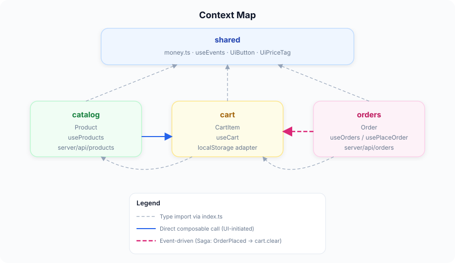
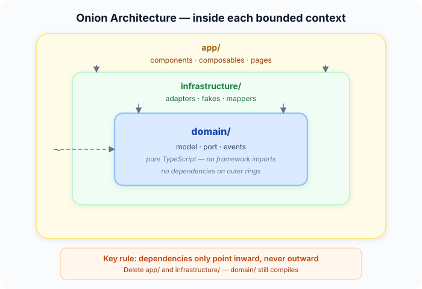
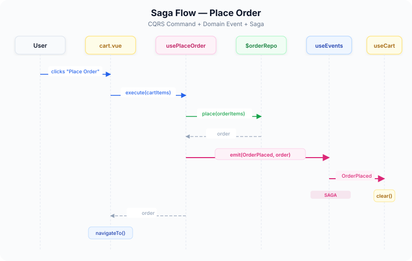

English | **[Русский](README.ru.md)**

# DDD with Nuxt 4

**DDD + Clean Architecture** template for large-scale **Nuxt 4** applications.  
Framework-native approach: the architecture is built on top of [Nuxt Layers](https://nuxt.com/docs/4.x/directory-structure/layers), not against the framework.

DDD defines **what** goes where (entities, ports, events, bounded contexts).  
Clean Architecture defines **how** layers relate (dependencies point inward, domain knows nothing about the outside).

E-commerce is used as an example domain — the patterns apply to any complex frontend project.

If you know what Bounded Context, Aggregate and Port are — but don't understand how they map to the frontend — this repo is for you.

---

## Quick start

```bash
git clone https://github.com/sofonoff/DDD-with-Nuxt.git
cd DDD-with-Nuxt
npm install
npm run dev
```

Opens at `http://localhost:3000`.

| Route | Description |
|---|---|
| `/` | Landing page |
| `/catalog` | Product catalog |
| `/catalog/:id` | Product detail |
| `/cart` | Cart + order placement |
| `/orders` | Order list |

---

## Why DDD on the frontend?

Frontend has grown up. It's no longer just "forms and buttons". A modern SPA/SSR is:
- Dozens of domains (catalog, cart, orders, user, payment...)
- Business logic on the client (validation, calculations, state machines)
- Multiple data sources (REST, WebSocket, localStorage, IndexedDB)
- A team of 5+ frontend developers who shouldn't break each other's code

The classic "pages + components + composables in one pile" approach stops working at scale. DDD provides clear boundaries and rules for who talks to whom.

---

## Project structure

Each **layer** is one **Bounded Context**. Inside — three layers following the Onion principle:

```
layers/
  catalog/                          # Bounded Context: product catalog
    domain/                         #   WHAT — model, port, events (pure TS)
    infrastructure/                 #   WHERE — adapters, fakes, mappers
    app/                            #   HOW — components, composables, pages
    server/api/products/            #   BFF (mock API)
    index.ts                        #   Public API of the context

  cart/                             # Bounded Context: shopping cart
    domain/ · infrastructure/ · app/ · index.ts

  orders/                           # Bounded Context: orders
    domain/ · infrastructure/ · app/ · server/ · index.ts

  shared/                           # Shared Kernel: money, events, UI kit
    domain/ · app/

app/                                # Root application (thin)
  plugins/providers.ts              #   DI: provide all adapters
  app.vue · pages/index.vue
```

---

## Context Map

<p align="center">
  
</p>

---

## Onion Architecture

Each context follows the **Onion / Clean Architecture** principle — dependencies point inward:

<p align="center">
  
</p>

- **domain/** — the core. Pure TypeScript. No Vue, no $fetch, no Nuxt. If you delete `app/` and `infrastructure/` — domain still compiles.
- **infrastructure/** — implements domain ports. Doesn't know about `app/`.
- **app/** — the outer ring. Components, composables, pages. This is where Nuxt lives.

Why this matters: swap REST for GraphQL — change one adapter. Redesign the UI — domain stays untouched. The onion layers protect each other.

### Between contexts

On the frontend, contexts communicate in **two ways** — both are legitimate:

**1. Direct call** — when the UI explicitly initiates an action:

```ts
// ProductList.vue — user clicked "Add to Cart"
const { addItem } = useCart()       // composable from another context
addItem(product)                    // direct, synchronous call
```

**2. Events** — when the caller shouldn't know about consequences:

```ts
// usePlaceOrder.ts — order placed, what happens next is not its concern
events.emit(OrderEvents.OrderPlaced, order)

// useCart.ts — decides to react on its own
events.on(OrderEvents.OrderPlaced, () => clear())
```

| Situation | Approach | Example |
|---|---|---|
| UI action: "do X right now" | Direct composable call | `useCart().addItem(product)` |
| Side effect: "X happened, react if you want" | Event | `OrderPlaced → cart.clear()` |
| Shared utilities, UI components | Shared layer | `UiButton`, `formatMoney()` |

**What's forbidden** — reaching into another context's internals:

```ts
// ❌ import from another's domain/ or infrastructure/
import { createOrder } from '../orders/domain/order.model'

// ✅ via public API
import type { Order } from '../orders'           // index.ts
const { fetchAll } = useOrders()                  // auto-imported composable
```

---

## Key patterns

### Mapping DDD to frontend

| DDD pattern | Backend | Frontend (Nuxt) |
|---|---|---|
| **Bounded Context** | Microservice | Nuxt Layer |
| **Entity / Aggregate** | Class with methods | `*.model.ts` — interface + pure functions |
| **Value Object** | Immutable class | `money.ts` — frozen object + helpers |
| **Repository (port)** | Interface | `*.port.ts` — TypeScript interface |
| **Repository (adapter)** | Impl with ORM | `*.adapter.ts` — $fetch / localStorage |
| **Domain Event** | Message broker | `useEvents()` — simple event bus |
| **Use Case / Command** | Application Service | Composable (`usePlaceOrder`) |
| **Query** | Read model | Composable (`useOrders`) |
| **Saga** | Orchestrator | Event listener in composable |
| **DI (Dependency Injection)** | Spring / DI framework | Nuxt plugin (`providers.ts`) |

### Ports & Adapters

Domain defines **what** is needed (port), infrastructure defines **how** (adapter):

```ts
// domain/product.port.ts — contract
export interface ProductRepository {
  getAll(): Promise<Product[]>
  getById(id: string): Promise<Product>
}

// infrastructure/product.adapter.ts — real implementation
export function createProductAdapter(): ProductRepository {
  return {
    async getAll() { return $fetch('/api/products') },
    async getById(id) { return $fetch(`/api/products/${id}`) },
  }
}

// infrastructure/product.fake.ts — fake for dev/tests
export function createProductFake(): ProductRepository {
  return {
    async getAll() { return fakeProducts },
    async getById(id) { return fakeProducts.find(p => p.id === id)! },
  }
}
```

### CQRS

Reading and writing — separate composables:

```ts
// useOrders.ts — Query: read only
export function useOrders() {
  async function fetchAll() { /* ... */ }
  return { orders, loading, error, fetchAll }
}

// usePlaceOrder.ts — Command: write only
export function usePlaceOrder() {
  async function execute(items: CartItem[]) { /* ... */ }
  return { execute, loading, error }
}
```

Why separate? Queries can be cached, deduplicated, SSR'd. Commands can't.

### Domain Events + Saga

<p align="center">
  
</p>

Domains don't know about each other — `usePlaceOrder` emits an event, `useCart` independently decides to react.

### Dependency Injection (DI)

All adapters are wired in one place — the Nuxt plugin acts as a DI container:

```ts
// app/plugins/providers.ts
export default defineNuxtPlugin(() => ({
  provide: {
    productRepo: createProductAdapter(),  // ← swap with createProductFake() for dev
    cartRepo:    createCartAdapter(),
    orderRepo:   createOrderAdapter(),
  },
}))
```

Composables get dependencies via `useNuxtApp().$productRepo` — they don't import the adapter directly. This inverts the dependency: domain defines the interface, infrastructure provides the implementation, and the plugin wires them together.

---

## What you get

**Parallel team work.** Two frontend devs work on `catalog/` and `orders/` simultaneously. ESLint enforces boundaries — they physically can't break each other's code.

**Instant domain testing.** Business logic is pure functions — 25 tests run in 200ms. No browser, no DOM, no framework bootstrap:

```ts
const cart = addToCart(emptyCart(), headphones)
expect(cartTotal(cart)).toBeCloseTo(299.99)
```

**Swap anything without fear.** REST → GraphQL? Change one adapter file. Redesign the UI? Domain stays untouched. The onion layers protect each other.

**Onboarding in minutes.** New developer opens `layers/` — sees business domains, not technical folders. Opens `domain/cart.model.ts` — reads business rules in pure TypeScript.

**Full-stack layers.** Each context has its own `server/api/` — BFF lives next to the frontend. Deploys as a single Nuxt app.

**Production-ready DI.** One env variable switches all adapters to fakes: `NUXT_PUBLIC_ADAPTER_MODE=fake npm run dev`.

**Future-proof.** If you outgrow a monolith — each layer already has clean boundaries. Extract to a separate repo or micro-frontend with minimal refactoring.

---

## Trade-offs

> These are conscious trade-offs, not problems. Every architecture decision has a cost.

**Needs scale to justify.** This template pays off when you have 3+ bounded contexts and 3+ developers. Below that — use standard Nuxt structure.

**Team alignment required.** The team must understand why port is separated from adapter. Document conventions in your project's wiki or ADR (Architecture Decision Records). Without shared understanding, any architecture degrades.

**More files per feature.** A new entity means `model.ts` + `port.ts` + `events.ts` + `adapter.ts` + `fake.ts` + `index.ts` + composable + tests. This is deliberate — each file has one responsibility.

**Event bus is intentionally simple.** `useEvents()` is an in-memory pub/sub — no delivery guarantees. Fine for UI side-effects. For complex event sourcing — replace with a robust solution, the interface stays the same.

---

## When to use

| Project scale | Recommended approach |
|---|---|
| Landing page, blog, marketing site | Standard Nuxt structure |
| 3-5 pages, solo developer | Standard Nuxt structure |
| 10+ pages, 2-3 developers | Nuxt Layers without DDD (split by features) |
| Complex business logic, 3+ developers | **DDD + Layers (this template)** |
| Multiple teams, independent deploy cycles | DDD + Layers → extract to micro-frontends later |

**Start simple, evolve when needed.** Begin with Nuxt Layers for code organization, add `domain/` when business logic appears, add `infrastructure/` when you need adapter swapping.

---

## Developer experience

### Testing + TDD

Domain is pure functions — tested without Vue, Nuxt, or mocks:

```bash
npm run test        # watch mode
npm run test:run    # single run
```

25 tests across all domains — run in ~200ms. Test files live next to the code: `domain/__tests__/cart.model.test.ts`.

This architecture is ideal for **TDD (Test-Driven Development)** — the Red → Green → Refactor cycle takes seconds. Domain has zero dependencies, so no database, HTTP mocks, or DI setup needed. Write the test first, implement the rule, move on.

### Switching adapters

```bash
# Real adapters (default) — calls server API
npm run dev

# Fake adapters — in-memory, no server needed
NUXT_PUBLIC_ADAPTER_MODE=fake npm run dev
```

Configured in [`app/plugins/providers.ts`](app/plugins/providers.ts) — the single DI entry point.

### ESLint boundaries

ESLint rule prevents bypassing context boundaries:

```ts
// ❌ ESLint error: don't import from another context's domain/ or infrastructure/
import { createOrder } from '../orders/domain/order.model'

// ✅ Allowed: import from public API
import type { Order } from '../orders'
```

Within your own context — imports are unrestricted.

### ACL (Anti-Corruption Layer)

In a real project, the API format rarely matches the domain model. The mapper converts between them:

```ts
// infrastructure/product.mapper.ts
function toDomain(dto: ProductApiDTO): Product {
  return {
    ...dto,
    image: dto.image_url,          // mapping: image_url → image
    category: dto.category_name,   // mapping: category_name → category
  }
}
```

**Without mapper:** API field rename breaks domain and all components.  
**With mapper:** API field rename breaks only `product.mapper.ts`.

---

## Shared layer (Shared Kernel)

Nuxt auto-imports components from **all** layers — `ProductCard` from catalog is technically available in orders.

**Rule: domain components stay in their domain. Shared gets only framework-agnostic primitives.**

```
layers/shared/
  domain/money.ts              # Value Object
  app/composables/useEvents.ts # Event bus
  app/components/ui/           # UiButton, UiInput, UiModal, UiPriceTag
```

**What goes to shared:** UI primitives without domain logic, Value Objects used across domains, cross-cutting composables.

**What stays in the domain (but is globally available via Nuxt auto-import):** `ProductCard`, `CartButton`, `useCart`, `useProducts`. These are the domain's public UI API. Moving `CartItem` to shared just because orders uses it would be wrong — it stays in cart.

---

## Adding a new Bounded Context

1. Create `layers/payment/`
2. Inside — `domain/`, `infrastructure/`, `app/`, `index.ts`, `nuxt.config.ts`
3. Describe the model in `domain/payment.model.ts`
4. Define the port in `domain/payment.port.ts`
5. Implement the adapter in `infrastructure/payment.adapter.ts`
6. Register the adapter in `app/plugins/providers.ts`
7. Create a composable in `app/composables/`
8. Export the public API in `index.ts`

Nuxt picks up the new layer automatically — pages, components, composables register without configuration.

---

## Comparisons

### vs FSD (Feature-Sliced Design)

FSD proposes fixed layers: `shared → entities → features → widgets → pages → app`. The problem: Nuxt **already has** conventions for `pages/`, `components/`, `composables/` with auto-import. FSD fights the framework, DDD + Layers uses it.

| | FSD | DDD + Layers |
|---|---|---|
| Grouping | By technical layer | By business domain |
| Framework | Agnostic (conflicts with Nuxt) | Native to Nuxt |
| Server routes | Not accounted for | In each layer |
| Best for | React/Vite without conventions | Nuxt, possibly Next.js |

### vs Micro-frontends

| | Folder split | DDD + Layers | Micro-frontends |
|---|---|---|---|
| Build & deploy | One | One | Multiple, independent |
| Boundaries | Convention only | Enforced (ESLint, index.ts) | Enforced (separate repos) |
| Complexity | Low | Medium | High |

This template is the **middle ground**: stronger boundaries than folders, simpler than micro-frontends. If you outgrow it — each layer can be extracted later because the boundaries are already clean.

---

## Glossary

| Term | What it means |
|---|---|
| **Bounded Context** | An isolated part of the system with its own model, rules and language. In this template — a Nuxt Layer. |
| **Aggregate** | A cluster of domain objects treated as a unit. Cart with its items is an aggregate. |
| **Entity** | An object with identity (has an `id`). Product, Order. |
| **Value Object** | An object defined by its value, not identity. Money(100, "USD") — two instances with same value are equal. |
| **Port** | An interface that domain defines for the outside world. "I need a `ProductRepository`" — without specifying how. |
| **Adapter** | An implementation of a port. `product.adapter.ts` implements `ProductRepository` via `$fetch`. |
| **CQRS** | Command Query Responsibility Segregation — separate read (Query) and write (Command) operations into different composables. |
| **Saga** | A reaction to a domain event that coordinates a side effect across contexts. OrderPlaced → cart.clear(). |
| **ACL** | Anti-Corruption Layer — a mapper that converts external API formats to your domain model, protecting the domain from external changes. |
| **DI** | Dependency Injection — passing dependencies from outside instead of creating them inside. `providers.ts` injects adapters into composables via `useNuxtApp()`. |
| **Shared Kernel** | Code shared between bounded contexts by agreement. The `shared/` layer with Money, event bus, and UI primitives. |
| **TDD** | Test-Driven Development — write the test first, then implement the code to pass it. Red → Green → Refactor cycle. |

---

## Stack

- **Nuxt 4** — framework
- **TypeScript** — type safety
- **Vitest** — domain testing
- **ESLint** — boundary enforcement
- **Nuxt Layers** — bounded context isolation
- **Nitro** — server routes (mock API)
